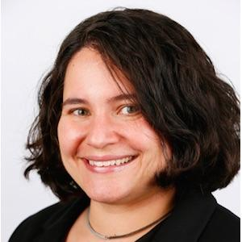
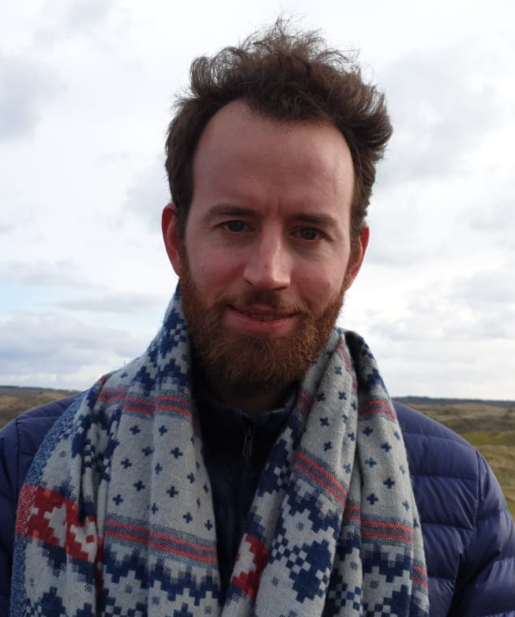

	

<h1 align="center">
    ResearchTube
</h1>

## Welcome!

I'm Magdalena Wojcieszak, a Professor at UC Davis and an Associate Researcher at the University of Amsterdam. Together with my Team (see our photos below), we are inviting you to participate in a study that is part of an international research project (ERC EXPO). We want to understand people’s opinions and how they use YouTube. 

### Why?
YouTube is a very popular and widely used platform. Knowing how people use it and what types of videos they watch is very important. We commit to protecting your confidentiality and privacy during our research.  

### What?
To understand how you use YouTube, we ask you to install a web browser extension on your computer. The extension will record the URL of the videos your visit on YouTube. 

### Important:
- We do not collect any other information, only the YouTube videos you watch. Please note that your experience of YouTube may slightly change during these three weeks due to our study. It will not, however, interfere with your ability to use YouTube as usual. 
- Our extension is not a black-box owned by a company or a corporation. We have created it ourselves at UC Davis and are committed to open-sourcing it at the end of our research. Our project is motivated by transparency, open access, and open research principles.
- Our research is in accordance with the highest ethical guidelines and standards and has been approved by the Ethical Review Board of the University of Amsterdam and also of the European Research Council. All the information about privacy can be found [here](https://ercexpo.github.io/ResearchTube/privacy-policy/). 

### How? 
The study will last 4 weeks. Today, you are asked to install our Chrome extension and complete a short survey (about 5 minutes). In three weeks, we will ask you to complete another short survey (about 5 minutes), and then leave the extension installed for one more week. If you participate, you will receive 5,000 YouGov polling points for installing the Chrome extension and taking the first survey.
If you do not install the plug-in, you will not be able to take part in this study.
You can only take each survey once.

### Who?
Our team has many great members… among others:
- Software development (browser extension) developed by Muhammad Haroon 
- Informed consent and privacy policies developed by Ericka Menchen Trevino & Magdalena Wojcieszak 
- Questionnaire and study development and design done by the entire Team
 
## Get in touch!
- Drop an email to magdalena.wojcieszak@uva.nl or mwojcieszak@ucdavis.edu if you have any questions about the study
- Drop an email to mharoon@ucdavis.edu if you want more information about the plug-in

We are also on Twitter @ERCEXPO and under our individual handles (see below)

## Authors

|  |  |  |  |  |  |
| :--: | :--: | :--: | :--: | :--: | :--: |
|Muhammad Haroon | Ericka Menchen-Trevino | Bernhard Clemm | Xudong Yu | Michael Heseltine | Magdalena Wojcieszak |
| [@mharoon_](https://twitter.com/mharoon_) | [@erickaakcire](https://twitter.com/erickaakcire) | [@BernhardClemm](https://twitter.com/BernhardClemm) | [@imxudong](https://twitter.com/imxudong) |  | [@mwojcieszak](https://twitter.com/mwojcieszak) |
